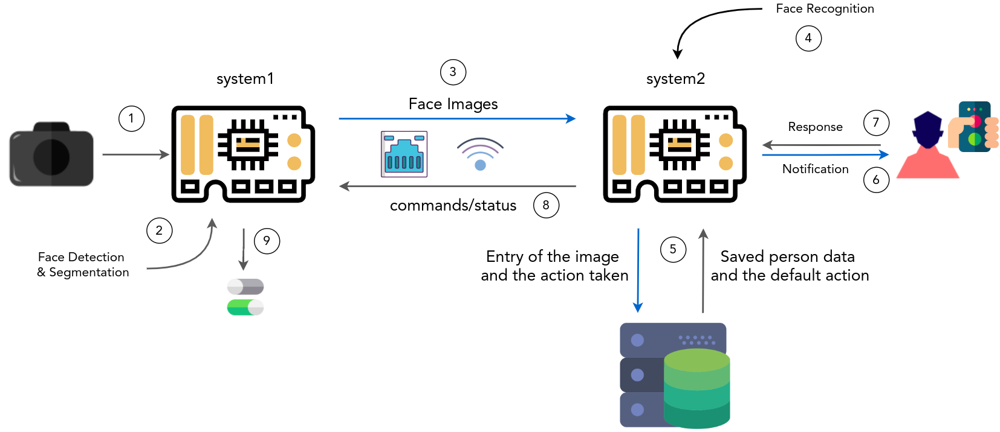

## FaceID-SecuritySystem

## Description

- FaceID-SecuritySystem is an biometric system for the access based on the face recognition.
- Consists of two low cost systems which are capable to perform the face detection and recognition.
- Notification to user with manual control on the access.
- Database of the user profiles for automatic access.

** This is work in progress **
